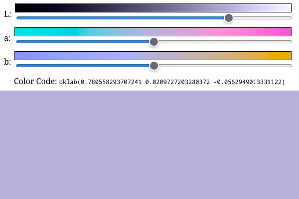

# oklab-color-wheel

A color mixer with [oklab color model](https://bottosson.github.io/posts/oklab/).

Hosted on: https://oklab-color-wheel.surge.sh

Made with [oklab.ts](https://github.com/beenotung/oklab.ts) and [snowpack](https://www.snowpack.dev/)
